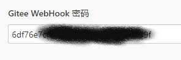

## 前言
折腾了下Jenkins做了一个Hello World项目，可以实现Hexo博客的自动构建、部署，顺带做了图片自动上传图床的功能（使用[Rclone](https://rclone.org)，此篇不展开讲解）

## 需求
本地提交并push更改到码云仓库之后，服务器自动pull并执行构建，然后部署到生产环境中

## 安装Jenkins
我的服务器环境是CentOS 8，参考[Jenkins官方文档](https://www.jenkins.io/doc/book/installing/linux/#red-hat-centos)安装Jenkins，如果你正在使用其他Linux发行版也可以在这个页面中找到安装方式

安装完成后执行以下命令启动Jenkins
```
systemctl start jenkins

//如果你正在使用缺失systemctl 的 WSL 
service jenkins start
```
用以下命令查看Jenkins运行状态
```
systemctl status jenkins

//如果你正在使用缺失systemctl 的 WSL 
service jenkins status
```


## 配置反向代理
这里使用宝塔面板+Nginx实现反代，在宝塔中创建站点`jenkins.edgeless.top`，部署SSL证书，然后添加反向代理

不过使用宝塔默认配置的反向代理是不正确的，如果这个时候你打开站点然后进入Jenkins全局配置就会看到Jenkins提示反向代理配置错误，详情可以参考[Jenkins官方文档](https://www.jenkins.io/doc/book/system-administration/reverse-proxy-configuration-troubleshooting/#ji-toolbar)

点击宝塔`站点修改`面板中`反向代理`选项卡中第一个反向代理配置的`配置文件`按钮修改刚刚的反向代理配置


将`location /`的配置修改为
```
    proxy_pass http://127.0.0.1:8080;
	proxy_redirect     default;
    proxy_set_header   Host             $host:$server_port;
    proxy_set_header   X-Real-IP        $remote_addr;
    proxy_set_header X-Forwarded-Host $host:$server_port;
    proxy_set_header X-Forwarded-Server $host;
    proxy_set_header X-Forwarded-For $proxy_add_x_forwarded_for;
    proxy_set_header X-Forwarded-Proto $scheme;
```


参考[Jenkins官方文档](https://www.jenkins.io/doc/book/system-administration/reverse-proxy-configuration-nginx/)

## 配置Jenkins
访问配置的域名，参考[Jenkins官方文档](https://www.jenkins.io/zh/doc/book/installing/#setup-wizard)完成初始化配置后进入Jenkins控制台

由于我的仓库托管在Gitee，这里先安装一个Gitee插件以便使用码云的WebHook功能触发构建操作

>如果你正在使用Github，系统已经安装了Github插件；如果正在使用Gitlab等其他托管平台也可以搜索对应的插件使用

点击左侧的`系统管理`按钮，然后点击`插件管理`按钮


切换到`可选插件`选项卡，在搜索框中输入`gitee`，勾选Gitee插件然后点击`Download now and install after restart`


勾选`安装完成后重启Jenkins(空闲时)`，等待下载完成后Jenkins自动重启安装插件


当Jenkins重启完成之后再次进入`系统管理`，然后进入`系统配置`


找到`Gitee配置`，参考[Gitee Jenkins插件文档](https://gitee.com/help/articles/4193#article-header6)完成码云接入


> 由于Jenkins默认使用密码为`admin`的`jenkins`账户执行命令，如果担心部分命令权限不够可以参考[这里](https://stackoverflow.com/questions/29926773/run-shell-command-in-jenkins-as-root-user)或[此篇问答的中文翻译](https://blog.csdn.net/wzqnls/article/details/78506149)将Jenkins默认执行用户更改为root


## 配置CI任务

重新进入首页控制台，点击左上角的`新建任务`


输入自定义的任务名称，并选中`构建一个自由风格的软件项目`，点击确定创建任务


第一栏为任务描述，可以自由发挥


第二栏为源码管理，我的源码仓库是公开的所以直接用了https协议，如果为私有仓库请自行添加证书


第三栏构建触发器中勾选`Gitee webhook 触发构建`，可选WebHook 密码


**复制这里出现的WebHook链接备用，例如图中的`https://jenkins.edgeless.top/gitee-project/Kanuo%20blog`**

如果需要配置密码，点击右侧`生成`按钮可以生成随机密码，同样将其复制备用



跳过第四栏，在第五栏中点击`增加构建步骤` - `执行shell`，填入以下命令
> 需要提前安装yarn和hexo-cli

```
# 安装依赖
/usr/local/bin/yarn

# 构建Hexo
/usr/local/bin/hexo g

# 清空生产环境文件夹
rm -rf /www/wwwroot/www.edgeless.top

# 将新版构建移动至生产环境文件夹
mv ./public/ /www/wwwroot/www.edgeless.top/
```


点击最下方的`保存`按钮保存配置，点击左侧的`立即构建`尝试执行构建任务，观察是否存在报错


## 配置Gitee WebHook
进入你的源码仓库，点击`管理` - `WebHook`，点击`添加 WebHook`


URL填入之前复制的请求地址，如果有密码也填入，然后点击`添加`


此时码云会发送一条测试请求，可以在项目面板中查看是否出现了这一请求


**正常情况下这一请求是无法正确被构建的**，因为测试请求缺少了一些必要信息会导致插件在运行git命令时出错，详情请参考[issue](https://gitee.com/oschina/Gitee-Jenkins-Plugin/issues/I1G7PK#note_2804941_link)，因此只要看到触发即可认为配置完成

尝试在本地更改源码并推送，观察Gitee和Jenkins是否正常工作