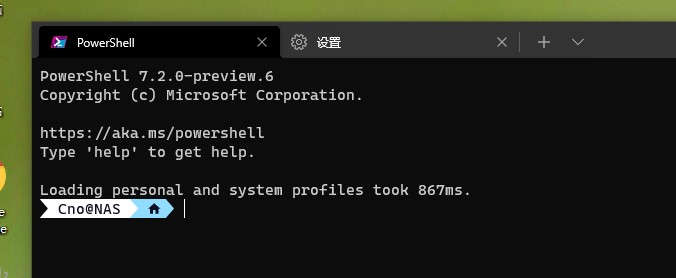

<script type="text/javascript" src="/js/push.js"></script>

## 前言
对于我来说终端的使用还是非常频繁的，因此在Windows端配置一个好用顺手的终端环境很有必要。网上搜到的很多所谓PowerShell美化教程都没有很好的鲁棒性，当有部件更新之后那些代码就会失效，也不标注出处，因此还是自己动手整理一下比较好。

## 选材
这里选用PowerShell 7 + Oh My Posh作为终端环境，Windows Terminal作为终端，最终效果图如下：


此外还可以从Windows Terminal中选择其他终端启动，如CMD或是某WSL2 Linux发行版的bash


## 安装Windows Terminal
在Microsoft Store中搜索Windows Terminal，或点击此链接：https://www.microsoft.com/zh-cn/p/windows-terminal/9n0dx20hk701


## 安装PowerShell 7
> 参考：[微软PowerShell安装文档](https://docs.microsoft.com/en-us/powershell/scripting/install/installing-powershell-core-on-windows?view=powershell-7.1)

Windows 10自带的PowerShell版本为PowerShell 5，而微软默认PowerShell 7只能与PowerShell 5共存，无法覆盖


首先从Github下载PowerShell 7的最新Release：https://github.com/PowerShell/PowerShell/releases ，这里选择64位MSI版安装包


安装PowerShell 7，一路回车即可


## 安装Oh My Posh
> 参考：[Oh My Posh Docs](https://ohmyposh.dev/docs/pwsh)

打开Windows Terminal，切换到PowerShell 7终端（也有可能已经被默认配置为PowerShell 7，注意版本号）


执行以下命令安装Oh My Posh：

```powershell
Install-Module oh-my-posh -Scope CurrentUser
```

输入`y`并回车确认（从不被信任的仓库安装）


## 配置Oh My Posh
执行以下命令使用记事本配置PowerShell启动脚本：

```powershell
notepad $Profile
```

如果提示不存在则点击“是”创建


输入以下内容然后保存：

```powershell
Import-Module oh-my-posh # 引入Oh My Posh模块
Set-PoshPrompt -Theme agnosterplus # 设置主题为agnosterplus
```

>注：此步骤中设置主题的命令可能会变化，请留意[官方文档](https://ohmyposh.dev/docs/pwsh/#replace-your-existing-prompt)

>更多主题样式请执行命令`Get-PoshThemes`或访问[官方主题](https://ohmyposh.dev/docs/themes)


新建一个PowerShell 7终端查看效果


可以看到Oh My Posh的配置已经生效了，但是会有乱码的情况出现。乱码是因为当前Windows Terminal使用的字体不是Nerd Fonts字体（见[官方文档](https://ohmyposh.dev/docs/fonts#nerd-fonts)），因此我们需要下载一份Nerd Fonts字体并配置为Windows Terminal使用的字体

## 使用Nerd Fonts字体
>参考：https://ohmyposh.dev/docs/fonts

访问[Nerd Fonts下载页面](https://www.nerdfonts.com/font-downloads)，选择任意一种字体下载。这里下载名为Caskaydia Cove Nerd Font的字体


选择其中任一带“Windows Compatible”后缀的字体安装


**重启Windows Terminal**，点击上面的“∨”按钮，选择设置进入设置界面

在左侧“配置文件”栏选择PowerShell，切换到“外观”选项卡，更改字体


将字体更改为刚刚下载的Caskaydia Cove，点击右下角保存


返回PowerShell终端，可以看到符号显示已经正常，至此基本配置完成



## 可选项
### 配置默认终端

### 设置模糊背景和背景图片

### 隐藏不想要的终端

>注：这里应该是官方翻译问题，应该翻译为“从下拉菜单中隐藏此配置（Profile）”
### 配置VSCode终端及字体
首先需要查看你下载的Nerd Fonts字体安装之后显示的名称


点击“文件-首选项-设置”，搜索“字体”，跳转到“功能-终端”，在“Terminal>Integrated:Font Family”中填写`CaskaydiaCove NF`

### 配置IntelliJ IDEA based IDE终端及字体
IDEA好像不支持自定义字体，随便选一个后缀带“NF”的字体即可

不过这个渲染出来的效果好像不是很好，我滚回cmd了


