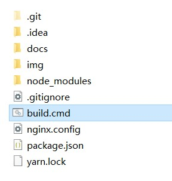

## 前言

Edgeless的官方文档已经迁移到了使用VuePress构建的v2版本，终于可以和码云丑出天际的MarkDown渲染器拜拜

使用码云时可以直接使用码云提供的服务器提供页面，改用VuePress之后就需要为渲染出的页面找一个安身之处——Github Pages访问速度不理想，Gitee Pages不支持使用自定义域名解析（需要开通专业版），那还是拜托我那可怜的腾讯云小水管了

VuePress官方提供了一键部署到Github Pages的命令，原理就是将编译后的文件夹初始化为git仓库然后强制推送覆盖Github Pages的对应仓库。对我这种一听到Git服务器就脑阔痛的懒狗来说，自己手动建Git服务器还不如莎了我（Gogs万岁！）

最后还是打算采用模拟手动操作的思路解决这个问题，大致分为以下几个步骤完成：

1. 编译构建静态页面
2. 压缩`dist`文件夹为zip压缩包
3. 上传压缩包到服务器，覆盖解压到网站根目录

## 准备

首先需要配置一下服务器端，为了避免每次脚本运行时都需要输入密码（因为使用了ssh和scp命令连接服务器），将本地生成的密钥文件放置到服务器的信任密钥文件中

进入本机的`C:\Users\用户名\.ssh`目录，打开`id_rsa.pub`文件

> 如果没有这个文件，请使用`ssh-keygen -t rsa`命令生成

连接服务器，执行命令`nano ~/.ssh/authorized_keys`，复制你的`id_rsa.pub`中的所有内容，粘贴进去，按`Ctrl+X`保存并返回

这样以后你可以直接使用ssh或是scp命令连接到你的服务器而无需输入密码

然后需要分别为服务器和本机安装压缩软件，服务器端安装`unzip`，本机安装`7-Zip`，具体如何安装请自行百度

## 代码
cmd代码如下：

```
@echo off

::更新源仓库（我使用了Gitee仓库做图床加速图片，因此这一步对我来说是必须得）
title Updating(1/5)
git add *.md
git add *.cmd
git add *.js
git add img
git commit -m "%date:~0,4%%date:~5,2%%date:~8,2%_%time:~0,2%%time:~3,2%%time:~6,2%%time:~9,2%"
git push

::编译构建静态页面
title Building(2/5)
cmd /c "yarn docs:build"

::压缩`dist`文件夹为zip压缩包，没有使用默认路径安装7-Zip的请自行修改路径
title Compressing(3/5)
cd /d ".\docs\.vuepress\dist"
"C:\Program Files\7-Zip\7z.exe" a -tzip dist.zip *

::清空服务器端的网站根目录（此处假设为127.0.0.1上的/www目录）
ssh root@127.0.0.1 "cd /www;rm -rf *"

::通过scp命令上传压缩包
title Uploading(4/5)
scp "dist.zip" root@127.0.0.1:/www

::在服务器端解压压缩包
title Unziping(5/5)
ssh root@127.0.0.1 "cd /www;unzip ./dist.zip"


title Finish
timeout 5
```

将以上代码复制到一个文本文件中，自行修改服务器的地址和网站根目录，将文本文件重命名为`build.cmd`并放在VuePress根目录中，运行此脚本来调试

