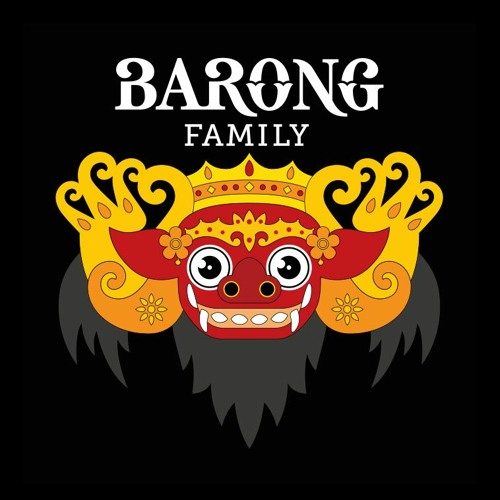

## 艺术家信息
|Key|Value|
| --- | --- |
|艺名|Yellow Claw
|中文称呼|黄爪
|国籍|荷兰
|流派|Various（exciting noise）
|厂牌|Barong Family
|入门难度|高

## 入坑来源
**视频：** TØm-你吹的什么玩意儿
**引用：** Ocho cinco-DJ Snake/Yellow Claw

https://www.bilibili.com/video/BV1ux411D7Zf?zw

## 正文
真正的粉丝不叫Yellow Claw而是狂喊"Yellow Motherfvcking Claw!!!"

这个组合十分擅长于制造"exciting noise"，怎么嗨怎么来，主打风格涵盖Trap/Carnival/Harddance等，入门难度高，不过当你能够get到他们制造的噪声中的high点时也会跟着OHHHHHHHHH起来

对黄爪风格的发扬作品可以在Barong Family厂牌找到，这个厂牌也正是由黄爪创建，厂牌更像是一个家庭俱乐部而非商业厂牌（因为这种风格的EDM作品实在很难被大众接受），签约的作者发的作品也都是些质量上乘的"exciting noise"

黄爪也并非所有作品都是嗑嗨了的感觉，有几首商业单做的House风格也很赞，毕竟编曲能力还是嗯的

## 代表作品
### Do You Like Bass? - Yellow Claw/Juyen Sebulba
**风格：** Carnival / Trap

**简评：** 公认的黄爪最经典的曲目，虽然名称里面有Bass但是明显是挂羊头卖狗肉，需要有一定时间的电音基础才有可能接受这样的风格。

光敏性癫痫患者请勿观看此曲对应的MV！
<iframe frameborder="no" border="0" marginwidth="0" marginheight="0" width=330 height=86 src="//music.163.com/outchain/player?type=2&id=504487145&auto=0&height=66"></iframe>

### New World - Yellow Claw/VaVa毛衍七/Krewella
**风格：** EDM Trap

**简评：** 带EDM前缀的风格多少沾点商业化，成品会更加容易被大众接受，也因此被诸多电音爱好者嘲讽“恰烂钱”“失去灵魂”等。但是黄爪过硬的混音技术依旧让New World获得了大量圈内人士的喜爱，也使得这首曲子成为了黄爪的一个代表作（尤其是在中国）。

New World第二段的Rap来自中国四川歌手毛衍七，MV也由中国团队带队录制，走的是东方元素赛博朋克风，与曲子本身营造的氛围十分相符。十分推荐这首作为Trap的入坑曲！
<iframe frameborder="no" border="0" marginwidth="0" marginheight="0" width=330 height=86 src="//music.163.com/outchain/player?type=2&id=520459383&auto=0&height=66"></iframe>

## 推荐作品

这里分两类推荐——[Hard](#Hard) / [Normal](#Normal)，分别对应[代表作品1](#Do-You-Like-Bass-Yellow-Claw-Juyen-Sebulba)和[代表作品2](#New-World-Yellow-Claw-VaVa毛衍七-Krewella)，可以在试听代表作品后选择对应的推荐作品

### Hard
>这一类下多为黄爪经典风格，很适合一边听一边OHHHHHHHHHHHH
>
>更多相似风格的曲目可以在Barong Family厂牌旗下找到

#### Ocho Cinco - DJ Snake / Yellow Claw
**风格：** Hardstyle / Trap

**简评：** 我迄今为止最爱的喊麦就出自这首中的“DJ Snake,and Yellow MotherFvcking Claw !!!”，还没发现能够超越这个的。

很难想象两个做Trap的制作人做起了Hardstyle，Kick很劲道，孩子很喜欢。

**链接：** https://music.163.com/#/song?id=420922944

**相关：** https://www.bilibili.com/video/BV1ux411D7Zf?zw

#### Supernoize - Yellow Claw/Juyen Sebulba/RayRay
**风格：** Carnival

**简评：** 又称Do You Like Bass? 2.0，黄爪和Juyen Sebulba合作的曲子总是能够让人感觉到嗑嗨了般的快感。

RayRay来自中国台湾，和Juyen Sebulba一样也是Barong Family签约制作人，作品也都带着浓浓的黄爪味。
<iframe frameborder="no" border="0" marginwidth="0" marginheight="0" width=330 height=86 src="//music.163.com/outchain/player?type=2&id=1421200518&auto=0&height=66"></iframe>

#### Bassgod - Yellow Claw/Juyen Sebulba/Sihk/Ramengvrl
**风格：** Carnival

**简评：** Do You Like Bass? 3.0，黄爪和Juyen Sebulba合作宁就放心吧。

Bassgod同时也是专辑《The Holy Bassgod EP》的主打，可以去听一下专辑里面的其他三首，质量也是上乘的。
<iframe frameborder="no" border="0" marginwidth="0" marginheight="0" width=330 height=86 src="//music.163.com/outchain/player?type=2&id=1809641407&auto=0&height=66"></iframe>

#### Don't Stop - Yellow Claw/Valentino Khan
**风格：** Trap / Carnival / Psystyle

**简评：** 可汗大叔与黄爪的梦幻联动！后半段的Psystyle真的很上头（虽然Khan在这首中的存在感很低，可能只是参与了编曲？）

这首所属的专辑《Amsterdam Trap Music, Vol. 3》的其他作品也非常经典，推荐进修。

**链接：** https://music.163.com/#/song?id=536622584

**相关：** https://www.bilibili.com/video/BV1KE411Y75X

***

### Normal
> 黄爪柔情的一面，更容易被大众接受的曲子
> 
> 包含部分商业单

#### Moonlight - Yellow Claw/刘柏辛Lexie/DOLF
**风格：** EDM Trap

**简评：** 和New World有些姊妹篇的意思，黄爪再次联手中国Vocal，甚至封面也换成了中国风的Barong吉祥物。

总感觉“Sit with me again so high”那边有点晚会散场时合唱的感觉？

**链接：** https://music.163.com/#/song?id=862102854

#### Lie To Me - Yellow Claw/Tinashe/Runtown
**风格：** Moombahton

**简评：** 很柔和的一首曲子不过封面非常暴露（？）所以网易云把封面删了，每次听的时候总感觉网不好封面没加载出来。

鼓点对Vocal的承托恰到好处而不抢风头，这样编曲风格的黄爪作品也是很难得见的（黄爪的主打风格通常鼓点都会非常劲道抢耳）
<iframe frameborder="no" border="0" marginwidth="0" marginheight="0" width=330 height=86 src="//music.163.com/outchain/player?type=2&id=1419696791&auto=0&height=66"></iframe>

#### End Like This (Arknights Soundtrack) - Steve Aoki/Yellow Claw/Runn
**风格：** Electro House

**简评：** 明日方舟的商单，黄爪再次与潮爷（的枪手）联手出曲，质量一般般奈何旋律抓耳，可以试试。
<iframe frameborder="no" border="0" marginwidth="0" marginheight="0" width=330 height=86 src="//music.163.com/outchain/player?type=2&id=1807756571&auto=0&height=66"></iframe>