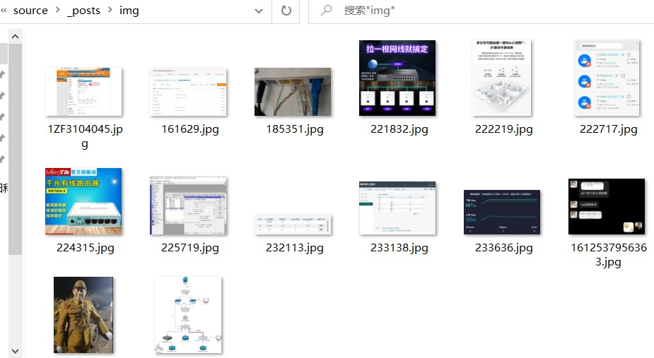
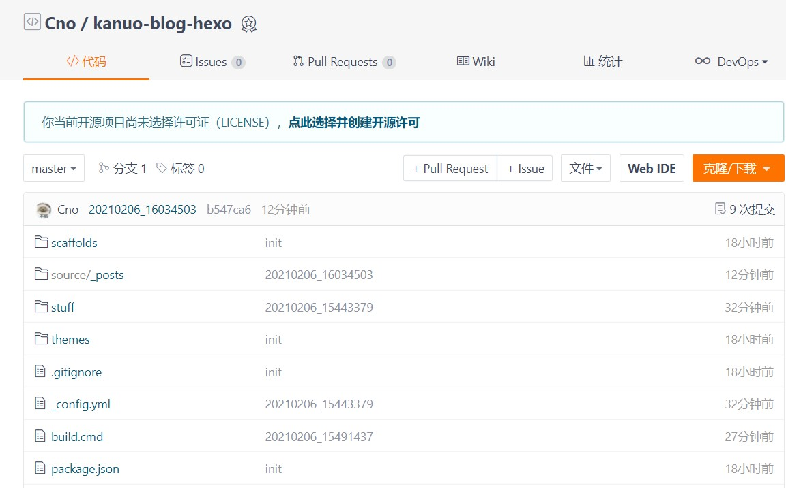
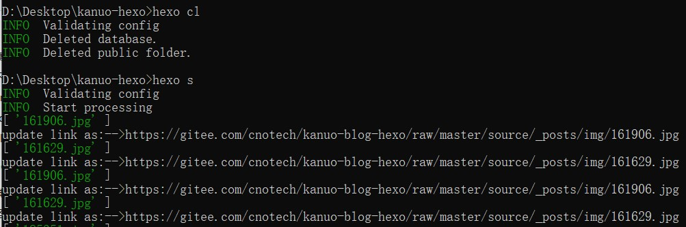

## 前言

最近研究了一下Hexo，搞了一个简单的静态博客，也总算是跟上时代了

腾讯云小水管服务器1M的带宽，实在是没法提供高质量的图片服务。结合之前折腾VuePress的一点点人生经验，这次也把图片托管在Gitee这只羊身上，薅国家队羊毛岂不美哉

## 准备
首先在hexo目录中找个位置建立`img`文件夹专门用于存放图片，我选择的位置是`/source/_posts/img`



对hexo文件夹执行git初始化，然后在Gitee新建一个仓库并把这个文件夹内的内容推送到这个仓库中



在写作过程中需要引用图片时，使用``就可以直接在编辑器中看到图片，例如``

> 如果你没有使用默认的post模板创作，则对图片的引用需要改为``

## 安装
加速的原理是将渲染页面的图片URL替换指向Gitee仓库，这里安装一个Hexo插件`hexo-asset-image`来完成此工作，定位到hexo的文件夹之后执行以下命令：
```
//npm
npm install hexo-asset-image

//yarn
yarn add hexo-asset-image
```

安装完成后打开`./node_modules/hexo-asset-image/index.js`，跳转到五十几行的位置，找到

```
$(this).attr('src', config.root + link + src);
```

将此行代码替换为

```
$(this).attr('src', 'https://gitee.com/{码云用户名}/{hexo仓库名}/raw/master/{img目录位置}/' + src);
```

示例

```
$(this).attr('src', 'https://gitee.com/cnotech/kanuo-blog-hexo/raw/master/source/_posts/img/' + src);
```

紧跟着这行代码的`console.info`函数参数中也有`config.root + link + src`的字段，也可以将其替换来查看图片替换位置是否正确

## 检查

>如果在img文件夹中新增了图片，记得先推送到仓库

在hexo文件夹中执行`hexo cl`清理缓存，再执行`hexo s`，就可以预览加速效果了



## 注意

* 向img文件夹中增加文件时尽量避免使用中文、空格等会被URL编码的字符，如果无法避免则请将`index.js`中的src变量先进行URL编码再替换
* 码云对自己被当成图床做出了反击，图片超过1M时需要登录才能正常看到，因此如果有超过1M的图片建议先用XnShell缩小体积然后提交