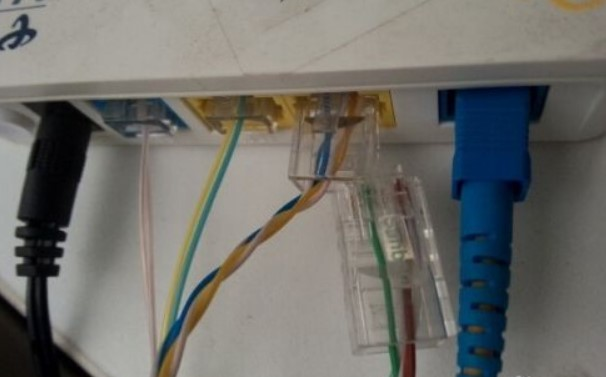
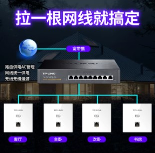
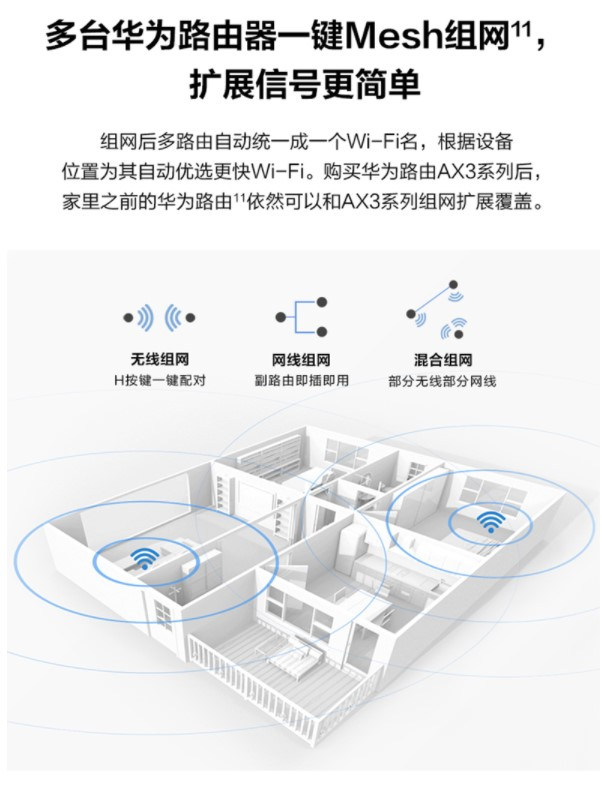
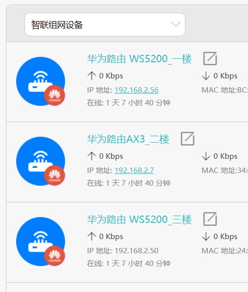
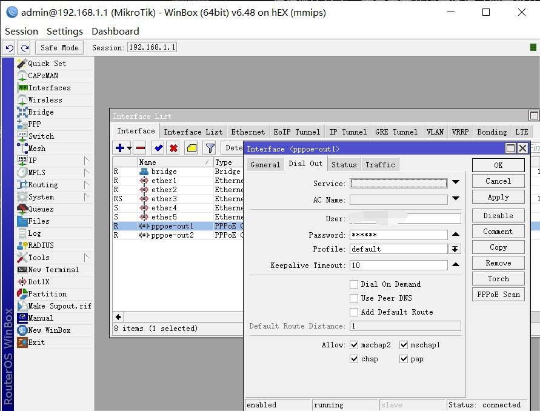
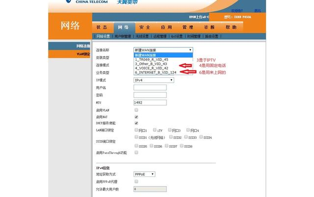
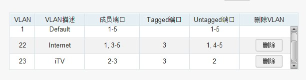
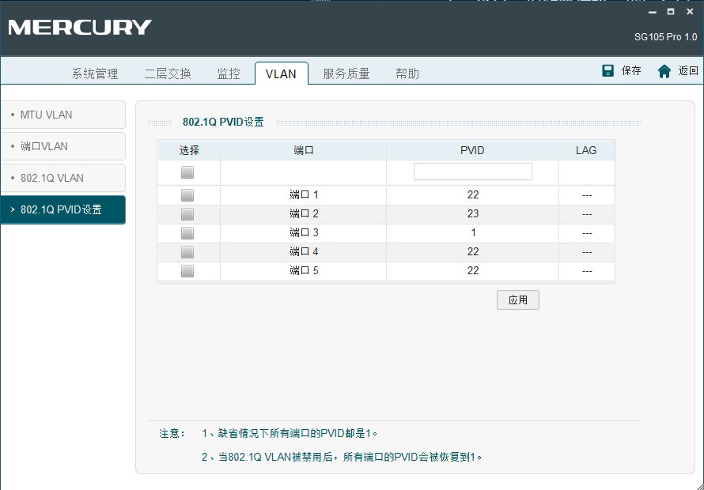
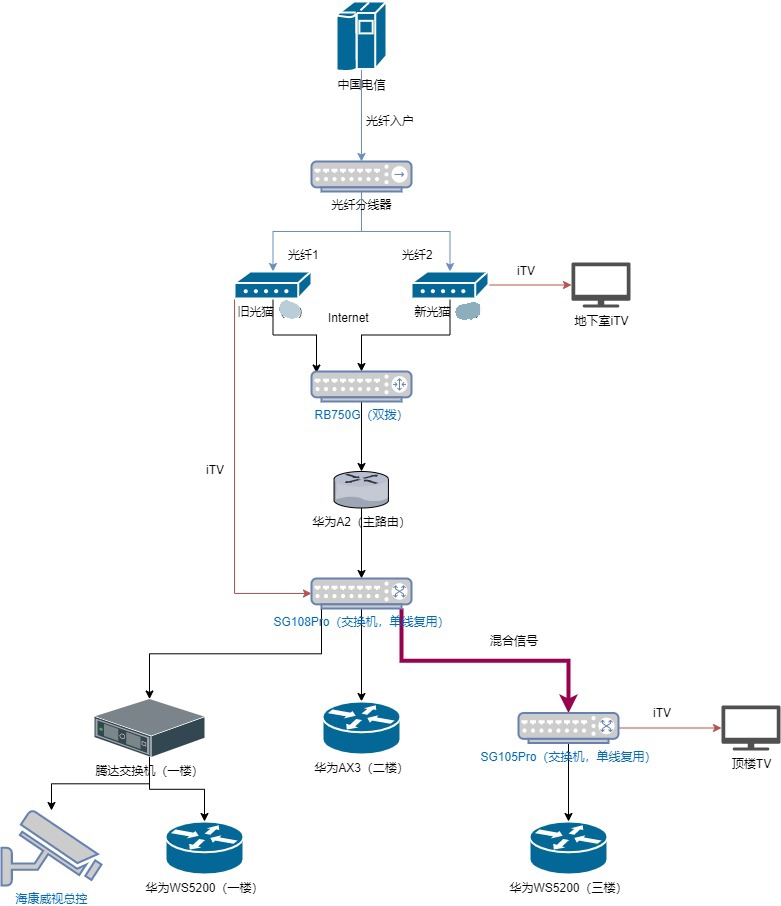
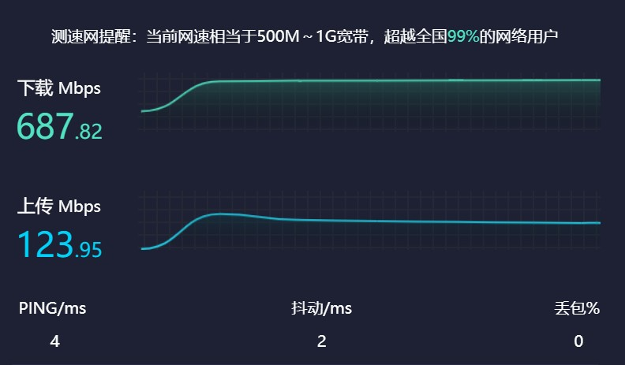

## 前言

老爸老妈的单位福利比较好，这次寒假两人都被免费送了电信5G全家桶，每个桶包含60G流量（1主卡+2副卡共享），300M的家宽和一台iTV。300M+300M双拨那香到🛫啊，这不整一下真的浪费。

## 需求

我们家房屋为小型连栋别野 ~~（墅）~~ ，3层+半地下室的楼房结构，光纤入户位置在地下室，需要看电视的位置分别为地下室的活动厅和顶楼主卧。

这个顶楼看📺的需求就比较麻烦，因为从入户弱电箱到顶楼的预埋网线只有一根，需要同时满足因特网和iTV需求。

此外需要布置全屋的WiFi漫游，能够保证串楼层行走时WiFi不会断开。

综上所述，简单整理一下家庭网络的功能需求：

* 全屋的WiFi漫游
* 双拨，300M+300M叠加宽带
* iTV需求，主要是顶层的iTV需求

## 现状

前期我们家的网络配置可以用一塌糊涂来形容，刚开始那会的入户宽带是200M，我爸被人忽悠买了一台只有WAN口是千兆的TP-LINK企业级路由器TL-WAR1200L，LAN口全是百兆，长这样

然后还不知哪里搞来一堆的百兆D-Link交换机和TP的便携路由器（好像是装海康监控的时候搭的？）

每层都放了一台交换机一个便携路由，每个便携路由发射SSID不一样的无线网络（命名风格：xxx-一楼，xxx-二楼，xxx是我家门牌号）

至于顶层如何使用iTV，骗我老爸买那个百兆企业级路由器的小伙子用上了极其先进的“物理层单线复用技术”，把超五类线拆成两根百兆线用

（网图-来自百度经验）

太行了哥，宁是惠山电信金牌合作伙伴？👍👍

## 改造
### 全屋WiFi漫游

WiFi漫游最简单的解决方案是通过企业级AP控制器+AP面板实现

但是呢这个方案的成本有些高昂，不仅好的控制器和面板死贵，还需要在拓扑中全套使用支持POE（以太网供电）的网络设备；而且我们家已经装修完毕，再去一个一个的更换网口面板有点费时费力，就不打算采用这种解决方案。

另一种方案就是Mesh组网，使用同一厂家生产的路由设备实现WiFi的接力，这种方案的好处在于无需提供POE，可以完美兼容原有的网络设备，而且节点的扩充也比较方便，买一个同一厂家的路由器接入就可以。

提供Mesh的厂商不少，上至华硕网件，下至腾达水星都有自己的Mesh技术，我这次选择的是菊花家的Mesh，一是感觉华为的网络技术应该比较成熟，不容易翻车，二是我爸对华为有那种中年人中很常见的偏爱，让他接受华为的网络会比较容易，三是华为Mesh的单个节点扩充比较便宜，二手WS5200在淘宝的售价已经打到85左右（这种一般是运营商版本，固件比较老旧，当然性能也会比官方在售的新版差点）

运营商送了一台WS5200，之前AX3系列首发的时候抢过一台AX3，再加上淘宝捡的一台二手WS5200和之前薅东哥羊毛买的A2，正好4台，一层一个

在主从路由的分配问题上没有纠结很多，首先我们家目前只有我拥有支持WiFi6的手机（小米10），AX3就理所当然的放在我那层做从路由；A2的soc据华为说算力比较强劲，就拿来做主路由，两个WS5200做从路由

（主路由A2没显示在图中）

华为的Mesh体验还是不错的，基本上就是即插即用，固件都更新到最新版本之后直接把路由器接到拓扑中开机就能自己认到主路由A2，自动同步WiFi配置然后开始工作，不需要任何手动设置。

刚开始还担心支持WiFi6的AX3会存在兼容性问题，但是事实上没有，走到二楼时我的小米10就显示已经连接到支持WiFi6的网络中，离开二楼则自动使用WiFi5。

### 双拨
双拨的实现需要使用到一些“高级”的路由系统，例如RouterOS、OpenWrt、ikuan等。在正式购买目标路由器之前先拿我的x86软路由（运行OpenWrt）试了试水，确定能够实现双线双拨后才下单购买了路由器。

我选择的路由器是Mikrotik的RB750G，也是被菠萝蛊惑买来试试水的。

这玩意的soc用的是非常经典的MT7621A，和斐讯k2p、新路由3同款，256MB RAM，配了5个千兆口并且支持POE。因为之前购入过新路由3，对MT7621A这个soc的性能还是有点底的，不高不低，做全千兆路由器刚好够用的水平，性能肯定比不上x86软路由（N3540：臭弟弟比划比划？）。不过RB750G的价值并不在于这块soc的性能，而是自带了永久L4授权的RouterOS。

刚认识菠萝那会菠萝就一直在给我推荐RouterOS（简称ROS），但是由于ROS入门门槛比较高，而且需要花钱买授权才能正常使用，那会对我来说光是OpenWrt就够我研究半天了，自然对ROS提不起兴趣。不过菠萝吹的东西当然是好东西，还是成功勾起了我的兴趣买来入坑 ~~（肯定不是因为支持OpenWrt的硬路由性能拉、软路由体积大塞不下）~~

ROS相比较于OpenWrt，在做路由这方面更加纯粹、更加稳定，路由方面的功能是一项不落，不过没有OpenWrt特色的插件拓展功能，也不支持安装第三方软件包，因此更多应用于专业路由场景。

还有不得不提WinBox，这个软件是Mikrotik官方提供的用于配置ROS的软件。说实话，习惯用IP+Web配置网络设备，第一次看到居然可以直接使用mac地址完成路由器配置的时候真的有点震惊，只用了链路层也行？也许这就叫专业吧。

这东西的界面一股浓浓的Win95开始菜单风味，不过支持多窗口也是很顶了，总体配置起来还算顺手。

双拨我没有自己配置，找菠萝要双线双拨的教程菠萝直接帮我远程搞了双拨，而且帮我做了防火墙配置提高转发效率，本来双拨只能跑到250M+250M，配置之后可以跑到350M+350M（和用OpenWrt跑出来的结果一样）

哦对，好像忘记说光猫改桥接的事。运营商给我们家弱电箱里面塞了两个光猫，分别百度搜型号拿到超级密码之后进入后台，将包含INTERNET字段的那个网络工作模式从Router改为Bridge即可。

（网图，现在光猫的IP地址被RB750G占用了连不上）

本来我是想把两个光猫合并为一个的，让一台光猫同时映射两个VLAN，结果拨号没法拨上，问了菠萝才知道是有loid限制，简单说一台光猫对应一个宽带账号，这个配置由运营商远程下发，没法更改。

### iTV-单线复用

最后来解决最棘手的问题了，顶层的iTV需求。

一开始想用电力猫把iTV的局域网信号通过电力线传到顶层，买回来之后发现没法用，问客服才知道电力猫不能跨空气开关工作，我们家每层都有独立的空气开关，因此这个方案行不通，直接把电力猫退货想新方案。

结合自己的一点计算机网络课程知识，我想到了使用VLAN区分因特网信号和iTV信号，搜了一下果然有人用这种方案成功实现了单线复用。成功的秘诀在于一台叫做SG105 Pro的网管交换机，使用交换机将不同的信号组到不同的虚拟局域网中，通过一根线缆传输，然后在另一头再解开，映射到物理端口上去。

那就直接开冲，正好地下室的百兆交换机还没升级，因此冲了一台SG108 Pro，一台SG105 Pro，交换机配置如下，其中1号口用于接入因特网信号，2号口接入iTV信号，3号口是单线复用线缆接口，其他口会传输正常的因特网信号，两台交换机配置相同

此外还需要配置交换机的PVID以提高转发效率，如果不配置这一项，你会看到在iTV机顶盒工作的时候交换机上所有的灯都在狂闪，就是因为有大量的iTV组播信号在交换机上疯狂转发，而不是点对点的传输到网口2上，导致这个网络中的普通网络设备不断地接收、丢弃iTV的组播信号，工作效率非常低下。

测试没问题之后，把原来的“物理层单线复用”剪了，tb花10块买了网线钳和水晶头自己把线还原，顶楼正式进入千兆时代

## 总结

至此这个中型的家庭网络已经配置完成了，放上一张目前网络的拓扑图：

（图中的腾达交换机是千兆的，不带网管功能）

测速结果

（上传有点坑，单线只给50）

再给电信打个电话申请一下公网IP，这不当场升天

