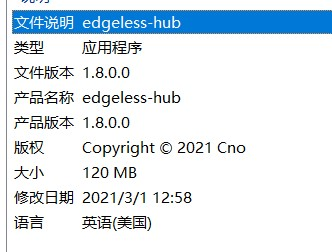
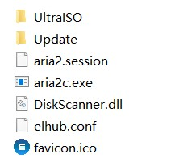
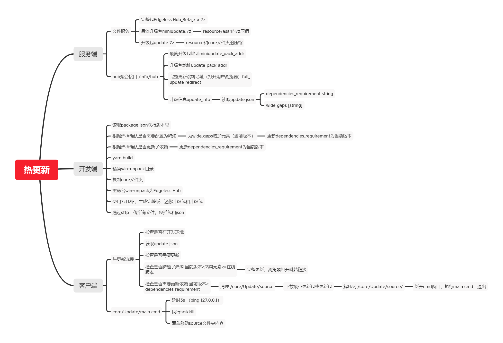
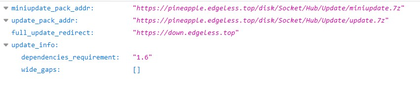

<script type="text/javascript" src="/js/push.js"></script>
## 前言
Edgeless Hub在主体功能实现后就需要开始考虑一些用户体验方面的内容了。众所周知Electron使用Chromium作为用户界面渲染器，而Chromium的体积却是有目共睹的巨大，每次有小的更新就直接重新下载一次Chromium也不是很现实，因此在生产时实现热更新还是有必要的。

## Why not... ?
Electron官方确实也考虑到了热更新的问题，因此提供了官方的轮子可供使用：[官方文档](https://www.electronjs.org/docs/tutorial/updates)

官方支持的方法是利用内置的Squirrel框架和Electron的autoUpdater模块，服务端有以下选择：

### Electron官方维护的开源网络服务[update.electronjs.org](https://github.com/electron/update.electronjs.org)

使用此服务非常依赖于Github，你需要满足以下条件：

1. 应用运行在 macOS 或者 Windows
2. 应用有公开的 GitHub 仓库
3. 编译的版本发布在 GitHub Releases
4. 编译的版本已代码签名

虽然Edgeless Hub的代码是public的，但是并没有托管在Github上，而且GitHub Releases对于境内用户来说速度并不是那么友好，因此我直接放弃了使用此服务

### 自建服务端
有多个现成的服务端轮子可供使用：
#### Hazel/Nuts
需要依赖GitHub Releases，同理放弃
#### electron-release-server
这个是我最中意的一个服务端，但是仓库没有提供二进制版本，Docker版本很旧未更新，而我在本地编译一直报错，排除所有应用未安装的报错后最后的报错出现在程序源代码中，那就只好放弃了，886
#### Nucleus
在yarn安装依赖时报错，也懒得排查了，直接拜拜

所以看下来，官方建议的使用Squirrel框架和autoUpdater模块实现的热更新我都因为服务端的问题放弃了，当然还有一些别的原因使得我即使能够成功安装服务端也不得不放弃使用，比如只支持electron-builder生成的安装版热更新而不支持绿色版

## 思路
基本的想法就是大体的Chromium主要程序不动，将被更改的渲染进场和主进程内容替换。查阅后发现确实有这么做的（还是在生产环境中），将使用asar打包生成的`app.asar`直接替换即可，也就是只涉及到resources目录内文件的替换。


看了看我本地生成的resources目录，里面的`elevate.exe`修改时间为2019年，应该就是不需要变动的二进制文件。然后`app.asar.unpacked`文件夹里面包含了一个`node_modules`文件夹，里面是没有被webpack打包的node模块依赖，也是不需要变动的。

在执行此方案之前有一个担心的点，就是仅替换`app.asar`之后我通过`app.getVersion()`获得的程序版本号会不会变，因为查看主程序时发现主程序的详细信息是带了版本号的



不过尝试之后发现好像并没有问题，`app.getVersion()`获得的程序版本号会变成最新的，不过这里也暴露了这种方案的一个缺点——主程序的版本号没法实现同步更新（除非你实现自动化反编译）

此外Edgeless Hub会使用一些外部依赖二进制文件，也需要考虑新版本更新了这个文件夹内的依赖的情况，就是这个`core`文件夹内的文件



热更新还需要一个更新进程（VSCode更新时左上角一闪而过的小框就是一个更新进程），因为`app.asar`在Electron运行时是处于被占用状态的，需要一个更新进程在主程序结束的时候替换文件，最简单的就是直接用cmd脚本实现

## 方案
简单整理后，做了一个思维导图，考虑了客户端、服务端和开发端的热更新解决方案



这种解决方案与官方方案的比较

|Feature|Official|This|
|-|-|-|
|二进制最小更新（blockmap）|√||
|不需要自己写代码|√||
|可以更新主程序版本号|√||
|追踪自定义依赖更新||√|
|后端不需要存大量差异文件||√|
|不需要在后端额外部署服务软件（可以与自己的服务端集成）||√
|支持绿色版更新||√|
|可以精简electron程序||√

## 代码

### 服务端代码（使用Rust + actix-web框架）

> 这个代码比较简单就不放完整代码了，可以拿node.js + express.js自己鲁

```
#[cached(time = 600)]
fn get_hub_data()->Result<HubDataQueryStruct,String>{
    let update_info=get_update_info()?;
    Ok(HubDataQueryStruct{
        miniupdate_pack_addr:String::from(STATION_URL)+"/Socket/Hub/Update/miniupdate.7z",
        update_pack_addr:String::from(STATION_URL)+"/Socket/Hub/Update/update.7z",
        full_update_redirect:String::from("https://down.edgeless.top"),
        update_info
    })
}
```

请求返回Json：



Json释义：
* miniupdate_pack_addr：仅更新`./resource/app.asar`时更新包的地址
* update_pack_addr：更新`./core/` `./resource/`两个文件夹时更新版的地址（`./resource/`目录包括了上面的`app.asar`）
* full_update_redirect：当需要全量更新时会打开用户浏览器跳转到下载地址
* update_info.dependencies_requirement：最后一次更新依赖的版本，如果当前版本低于此版本则需要下载`update_pack`
* update_info.wide_gaps：鸿沟，当检测到跨越鸿沟升级（当前版本<鸿沟元素<=在线版本）时使用全量更新，会打开用户浏览器跳转到下载地址

### 客户端代码
```
//Index.vue

<template>
<div>
  <keep-alive>
    <HotUpdate/>
  </keep-alive>
</div>
</template>
<script>
import HotUpdate from "@/components/HotUpdate"
export default {
    components:{
    HotUpdate
  }
}
</script>
```

> 热更新组件的代码，比较长，实现思路参考上面的思维导图
```
//HotUpdate.vue

<template>
  <div>
    <a-alert
        v-if="hotUpdateInfo.needUpdate"
        :message="'Edgeless Hub '+$store.state.hub_online_version+' 现已可用👌'"
        type="info"
        show-icon
        closeText="更新"
        @close="confirmUpdate"
    />
  </div>
</template>

<script>
import DownloadManager from "@/components/DownloadManager";
import {notification} from "ant-design-vue";
export default {
name: "HotUpdate",
  data(){
  return{
    hotUpdateInfo:{
      needUpdate:false,//总开关
      hubApiData:{"miniupdate_pack_addr":"https://pineapple.edgeless.top/disk/Socket/Hub/Update/miniupdate.7z","update_pack_addr":"https://pineapple.edgeless.top/disk/Socket/Hub/Update/update.7z","full_update_redirect":"https://down.edgeless.top","update_info":{"dependencies_requirement":"1.5","wide_gaps":["1.5"]}},
      updateMethod:"FULL_UPDATE",//FULL_UPDATE,HOT_UPDATE,MINI_UPDATE，分别对应手动全量更新、含依赖的增量更新和最小更新，最常用的是最小更新
    },
    interval:"",
  }
  },
  methods:{
    async generateUpdateInformation(){
      //检查是否在开发版本
      if(!this.$electron.ipcRenderer.sendSync('isDev-request')){
        //如果没获取过在线版本号则发送请求
        if(this.$store.state.hub_online_version===""){
          let online_version_res=await this.$axios.get("https://pineapple.edgeless.top/api/v2/info/hub_version")
          this.$store.commit('updateHubOnlineVersion',online_version_res.data)
        }
        //检查版本号
        if(this.$store.state.hub_online_version>this.$store.state.hub_local_version){
          this.hotUpdateInfo.needUpdate=true
          //修改标题
          document.title='Edgeless Hub '+this.$store.state.hub_local_version+'  ('+this.$store.state.hub_online_version+'版本已可用)'
          //获取hub聚合信息
          if(this.$store.state.hub_api_data===""){
            let res=await this.$axios.get("https://pineapple.edgeless.top/api/v2/info/hub")
            this.hotUpdateInfo.hubApiData=res.data
            this.$store.commit('updateHubApiData',res.data)
          }else{
            this.hotUpdateInfo.hubApiData=this.$store.state.hub_api_data
          }
          //console.log(this.hotUpdateInfo.hubApiData)
          //检查是否跨越了鸿沟
          let needFullUpdate=false
          this.hotUpdateInfo.hubApiData.update_info.wide_gaps.forEach((item)=>{
            if(this.$store.state.hub_local_version<item&&item<=this.$store.state.hub_online_version) needFullUpdate=true
          })
          if(needFullUpdate){
            //需要手动下载
            this.hotUpdateInfo.updateMethod="FULL_UPDATE"
          }else{
            //检查是否需要连依赖更新
            if(this.$store.state.hub_local_version<this.hotUpdateInfo.hubApiData.update_info.dependencies_requirement){
              this.hotUpdateInfo.updateMethod="HOT_UPDATE"
            }else{
              this.hotUpdateInfo.updateMethod="MINI_UPDATE"
            }
          }
        }
      }
    },
    confirmUpdate(){
      this.$store.commit('setHotChecked')
      console.log(this.hotUpdateInfo.updateMethod)
      if(this.hotUpdateInfo.updateMethod==="FULL_UPDATE"){
        this.$electron.shell.openExternal(this.hotUpdateInfo.hubApiData.full_update_redirect)
      }else if(this.hotUpdateInfo.updateMethod==="MINI_UPDATE"){
        this.addHotUpdateTask(this.hotUpdateInfo.hubApiData.miniupdate_pack_addr)
      }else{
        this.addHotUpdateTask(this.hotUpdateInfo.hubApiData.update_pack_addr)
      }
    },
    addHotUpdateTask(url){
      //清理./core/Update/source
      DownloadManager.methods.delDir("./core/Update/source")

      //创建工作目录
      DownloadManager.methods.mkdir("./core/Update/source")
      DownloadManager.methods.mkdir(this.$store.state.downloadDir + '\\Update')

      //添加下载任务
      DownloadManager.methods.aria2cDownloaderDir(url, true, this.$store.state.downloadDir + '\\Update', (res) => {
        this.$store.commit('setHotGid', res.data.result)
        console.log('HotUpdate start downloading')
      })

      //配置定时器监视下载情况
      this.interval=setInterval(()=>{
        if(this.$store.state.HotUpdateInfo.taskStopped){
          if(this.$store.state.HotUpdateInfo.task.completedLength!==0&&this.$store.state.HotUpdateInfo.task.completedLength===this.$store.state.HotUpdateInfo.task.totalLength){
            //确实已经完成

            //解析文件名
            let split_result=url.split("/")
            let fileName=split_result[split_result.length-1]
            console.log(fileName)

            //发送解压请求
            this.$electron.ipcRenderer.send('unzip-request',{
              zip:this.$store.state.downloadDir + '\\Update\\'+fileName,
              path:"./core/Update/source"
            })
          }else{
            //下载失败
            notification.open({
              message:'Edgeless Hub热更新失败',
              description:"下载增量更新包时出错，请访问官网获取新版"
            })
          }
          clearInterval(this.interval)
        }
      },1500)

      //监听unzip完成事件
      this.$electron.ipcRenderer.on('unzip-reply',(event,args)=>{
        if(args!==this.$store.state.downloadDir + '\\Update\\update.7z'&&args!==this.$store.state.downloadDir + '\\Update\\miniupdate.7z') return
        //将./core/Update/main.cmd提到根目录
        DownloadManager.methods.copy("./core/Update/main.cmd","./main.cmd",true,()=>{})
        //注册退出时更新
        this.$electron.ipcRenderer.send('updateOnExit',"")
        //弹出通知
        notification.open({
          message:'Edgeless Hub热更新准备就绪',
          description:"当您关闭程序时会执行热更新"
        })
      })
    }
  },
  created() {
    if(this.$store.state.HotUpdateInfo.checked) return
    this.generateUpdateInformation()
  }
}
</script>

```

```
//background.js

var updateOnExit=false

const win = new BrowserWindow={...}
    win.on('close', (event) => {
        killAria2c()
        if(updateOnExit){
            console.log('run updater')
            cp.exec('start cmd /c main.cmd')
        }
        //console.error('close')
        app.exit()
    })

ipcMain.on('updateOnExit',(event,payload)=>{
    updateOnExit=true
})
```


客户端的更新进程（cmd脚本）
```
@echo off
title Edgeless Hub 热更新程序
color 3f

::校验运行目录正确性
if not exist edgeless-hub.exe (
    echo 错误：更新程序不应在此目录运行
    echo %~dp0
    pause
    exit
)

::延时2s杀死进程
echo 正在等待主进程结束...
@ping 127.0.0.1 -n 2 >nul
TASKKILL /F /IM edgeless-hub.exe /T

::覆盖复制文件
xcopy /s /r /y .\core\Update\source\* .\

::退出
echo Edgeless Hub 更新完成，程序将在3s后退出
@ping 127.0.0.1 -n 3 >nul
del /f /q "%0"
```

开发端（cmd脚本，使用[JSON Stream Editor](https://github.com/tidwall/jj)读写.json文件）

```
::main.cmd

@echo off
set stage=Beta

::读取版本号
call readJson ..\package.json version
set "version=%getValue_%"
title 发布Edgeless Hub %version%

::条件选择
echo 1.此版本只需最小更新（默认）
echo 2.需要连依赖更新
echo 3.需要全量更新
set /p choice=输入序号或直接回车：

if "%choice%"=="2" (
    call writeJson Workshop\update.json dependencies_requirement %version:~0,-2%
)
if "%choice%"=="3" (
    call writeJson Workshop\update.json dependencies_requirement %version:~0,-2%
    call writeJson Workshop\update.json wide_gaps.-1 %version:~0,-2%
)

::编译
title 发布Edgeless Hub %version%-编译（1/6）
cd ..
cmd /c "yarn electron:build"

::精简win-unpack目录
cd dist\win-unpacked
del /f /s /q swiftshader
rd swiftshader
del /f /q d3dcompiler_47.dll
del /f /q LICENSE.electron.txt
del /f /q LICENSES.chromium.html
del /f /q vk_swiftshader.dll
del /f /q vk_swiftshader_icd.json
del /f /q vulkan-1.dll
del /f /q locales\am.pak
del /f /q locales\ar.pak
del /f /q locales\bg.pak
del /f /q locales\bn.pak
del /f /q locales\ca.pak
del /f /q locales\cs.pak
del /f /q locales\da.pak
del /f /q locales\de.pak
del /f /q locales\el.pak
del /f /q locales\es-419.pak
del /f /q locales\es.pak
del /f /q locales\et.pak
del /f /q locales\fa.pak
del /f /q locales\fi.pak
del /f /q locales\fil.pak
del /f /q locales\fr.pak
del /f /q locales\gu.pak
del /f /q locales\he.pak
del /f /q locales\hi.pak
del /f /q locales\hr.pak
del /f /q locales\hu.pak
del /f /q locales\id.pak
del /f /q locales\it.pak
del /f /q locales\ja.pak
del /f /q locales\kn.pak
del /f /q locales\ko.pak
del /f /q locales\lt.pak
del /f /q locales\lv.pak
del /f /q locales\ml.pak
del /f /q locales\mr.pak
del /f /q locales\ms.pak
del /f /q locales\nb.pak
del /f /q locales\nl.pak
del /f /q locales\pl.pak
del /f /q locales\pt-BR.pak
del /f /q locales\pt-PT.pak
del /f /q locales\ro.pak
del /f /q locales\ru.pak
del /f /q locales\sk.pak
del /f /q locales\sl.pak
del /f /q locales\sr.pak
del /f /q locales\sv.pak
del /f /q locales\sw.pak
del /f /q locales\ta.pak
del /f /q locales\te.pak
del /f /q locales\th.pak
del /f /q locales\tr.pak
del /f /q locales\uk.pak
del /f /q locales\vi.pak
del /f /q locales\zh-TW.pak
del /f /q locales\en-GB.pak

::复制core文件夹
title 发布Edgeless Hub %version%-复制core文件夹（2/6）
cd ..
cd ..
xcopy /s /r /y core dist\win-unpacked\core\

::清理垃圾
cd dist
del /f /q *.exe
del /f /q *.blockmap

::重命名win-unpack
del /f /s /q "Edgeless Hub"
rd /s /q "Edgeless Hub"
ren win-unpacked "Edgeless Hub"

::生成三种压缩包
title 发布Edgeless Hub %version%-生成完整包（3/6）
"C:\Program Files\7-Zip\7z.exe" a -t7z -mx9 "Edgeless Hub_%stage%_%version:~0,-2%.7z" "Edgeless Hub"

cd "Edgeless Hub"
title 发布Edgeless Hub %version%-生成update包（4/6）
"C:\Program Files\7-Zip\7z.exe" a -t7z -mx9 "update.7z" "core" "resources"
title 发布Edgeless Hub %version%-生成miniupdate包（5/6）
"C:\Program Files\7-Zip\7z.exe" a -t7z -mx9 "miniupdate.7z" "resources\app.asar"
cd ..
cd ..
del /f /q release\Workshop\*.7z
move /y "dist\Edgeless Hub\update.7z" "release\Workshop\update.7z"
move /y "dist\Edgeless Hub\miniupdate.7z" "release\Workshop\miniupdate.7z"
move /y "dist\Edgeless Hub_%stage%_%version:~0,-2%.7z" "release\Workshop\Edgeless Hub_%stage%_%version:~0,-2%.7z"

::通过WinSCP上传三个包和update.json
title 发布Edgeless Hub %version%-上传文件（6/6）
cd release
"D:\CnoRPS\WinSCP 5.15.9.10071\WinSCP.exe" /console /script=scp_script.txt /parameter // "Edgeless Hub_%stage%_%version:~0,-2%.7z"
exit
```

```
::readJson.cmd

@echo off
set "infile_=%1"
set "keypath_=%2"
set getValue_=
jj -i %infile_% %keypath_% >tmp
typex tmp>val
set /p getValue_=<val
del /f /q tmp
del /f /q val
```

```
::writeJson.cmd

@echo off
set "infile_=%1"
set "keypath_=%2"
set "value_=%3"

jj -r -v %value_% -i %infile_% %keypath_% -o 1.json
move %infile_% %infile_%.bak.json
move 1.json %infile_%
```

```
//update.json

{
    "dependencies_requirement":1.6,
    "wide_gaps":[]
}
```

```
//scp_script.txt

option batch continue
open 菠萝云
lcd D:\Desktop\Projects\edgeless-hub\release\Workshop
cd /hdisk/edgeless/Socket/Hub
put "%1%"
cd /hdisk/edgeless/Socket/Hub/Update
put update.json
put update.7z
put miniupdate.7z
exit
```


## 效果
最终的实现效果就是当有更新时在Edgeless Hub的首页上面会出现一个提示，点击更新按钮时，如果支持热更新则提示会消失，程序在后台下载更新包并解压，完成后弹出通知告知用户热更新将在程序关闭后开始；当electron退出时会运行更新程序完成更新。